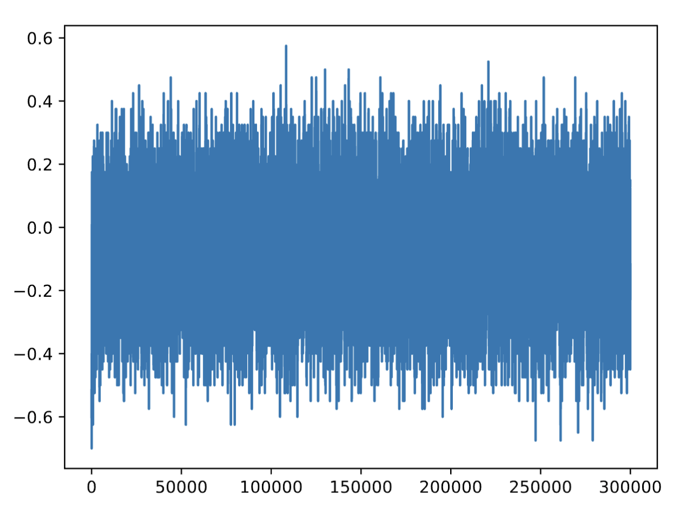

# Overview

Implementation of the SARSA algorithm.

###### Temporal difference prediction

The implementation of the algorithm can be found in tdagent.py.

###### SARSA

The implementation of the algorithm can be found in sarsaagent.py.

## Representation of State

We know many ways how we can represent the states of a problem. The simplest representation of a problem state is information about the total value of the cards that we and the dealer hold.

The state is represented as a pair of values (player_hand, dealer_hand), which indicate the total sum of the card values in the dealer's and the player's hands.

In this case, the state is represented by an enumeration of cards that I have in my hand, written in a way that for each type of card, we specify the number of cards of that type we have in our hand, and in addition, the information about the card that the dealer has shown us, from which we can later calculate the cards that are still in the deck. The game includes cards ace, two, three, four, five, six, seven, eight, nine, ten, jack, queen, king, and each of these for 4 different suits.
The state can then be written in the following way.
(ace_count, two_count, ..., king_count, initial_dealer_card)

The value of the cards in hand and whether we have an ace
Very similar to the first case except that each state has additional information about whether we have an ace in hand or not. The state can be described as follows.
(player_hand, dealer_hand, ace_info)

# The number of possible states

In the following text, we describe the number of possible states for the above-mentioned representations of the game.

## Value of cards in hand

The value of the player's cards can be up to 30, in the case of having J, Q, and K cards in hand. For the dealer, we only see one card, and its highest value can be 11 for an ace. Thus, an estimated 330 states.

## The value of the cards in hand and whether we have an ace

The calculation follows from the first case, with additional information on whether we have an ace in hand or not. The estimated number of states is 330 * 2.

## Chosen representation of the game state

As the chosen representation, I have selected the value of the cards in the hand of the player and the dealer and information about whether we have an ace in hand or not. This representation is very simplified and definitely does not capture all the information a player might use when deciding. The player then misses information about their suit and also information about the specific card of the dealer. These pieces of information could provide them with a better strategy for decision-making. I chose this representation because it did not give much different results from the representation with information about the number of aces that might still be in the deck, and it seemed simpler to me. Of course, the result of the final policy and utility values will be different from less simplified methods because with additional information, such as the number of cards in the deck, one can play less or more riskily, since, for example, it assumes higher card values. The answer to the question of whether we can use policy/value iteration is yes, because we know the probabilities of transitioning between states, as we know the probability of receiving a card in hand i.e., we know the state, our reward, and also the action, and at the same time, we know the dealer's strategy.
I chose the discount factor 𝛾 = 1, because at 0 it does not learn, and values close to 1 ensure that they take into account the latest learning, at the same time, the value of 𝛾 = 1 ensures convergence.
We have approximately 660 states, which means that for the values to stabilize, we need several visits to each state, about at least 100 for each state to get the information from the final to the initial state. This means that the number of learning epochs is in the order of several hundreds of thousands to get into each state several times. Experimentally, I tried 100k, 200k,... over 600k. However, from 300k onwards, the computation took a very long time, and I waited a long time for it, so I chose 330k, where the average utility reached similar values and the values more or less stabilized even at a lower number such as 100k, but we did not visit all states multiple times.

# Comparison of methods

In the following text, we compare the strategies of agents. The tests were conducted after a number of games 100k/200k/300k.

## Average utility

**Number of games: 100k**

* Random agent = −0.39212
* Dealer agent = −0.08221
* TD agent = −0.07743
* SARSA agent = −0.075

**Number of games: 200k**

* Random agent = −0.39169
* Dealer agent = −0.078945
* TD agent = −0.080065
* SARSA agent = −0.075

**Number of games: 300k**

* Random agent = −0.39469
* Dealer agent = −0.07755
* TD agent = −0.07779
* SARSA agent = −0.07756

As we can see from the results, the Random agent performed the best in the conducted experiments. Dealer, TD, and SARSA agents achieved very similar results.

On the provided picture below there is a moving average average for 300k games for SARSA agent depicted.

# Learned utilities

Learned utilities for possible states of the game matched my intuition. Below is a list of some in the following format.

`(player_value, dealer_value, ace_info) = [Q STAND, Q HIT]`

* (20,11, True) = [0.14847552240891543, -1.0]
* (16,11, False) = [-0.9878542510121457, -0.5806284054993834]
* (9,4,False) = [-0.955249569707401, 0.1107513537801633]
* (14,6,False) = [-0.146306511934146, -0.7633890065082726]
* (18,5,False) = [0.2348794644981319, -0.5171061754191014]
* (9,2,False) = [-0.8193979933110368, 0.08639849072516707]
* (21,5,True) = [0.9062851592428226, -1.0]
* (12,2,False) = [-0.9597069597069597, -0.23402682301997157]
* (8,3,False) = [-0.6531041366466318, 0.0690370811628313]
* (19,6,False) = [0.5631940136725908, -0.9090909090909091]
* (19,9,False) = [0.2924221278200085, -0.9481737330325174]

All the decisions listed above make sense. In the case of a high sum, the preferred decision is to STAND, and conversely, in the case of a low sum, to HIT. It seems that the strategy learned by SARSA corresponds to the recommended conditions of Blackjack strategy.

The convergence properties of the SARSA algorithm depend on the policy's dependence on Q. In our case, we use an epsilon-greedy policy, where SARSA converges with probability 1 to the optimal policy, provided that state-action pairs were visited an infinite number of times.

However, I think it would be appropriate to choose a better strategy since the SARSA agent did not perform much better. Therefore, it would be appropriate to improve the strategy to remember not only the sum of cards in the state but also the number of high cards, meaning jack, queen, and king in hand, as well as the suit of cards.

The code itself was tested with a debugger, and I monitored whether the alpha values decrease after each round. Also, by the method get_hypothesis, when I was verifying learned utilities.
